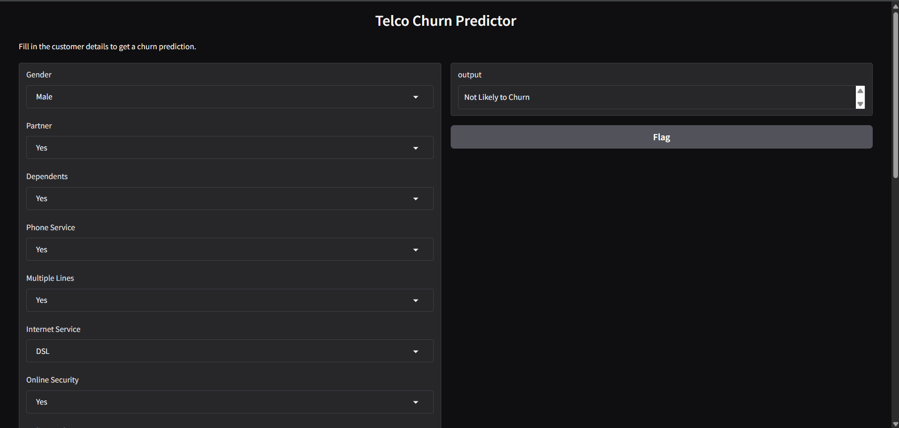
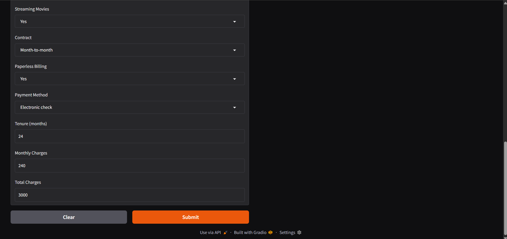
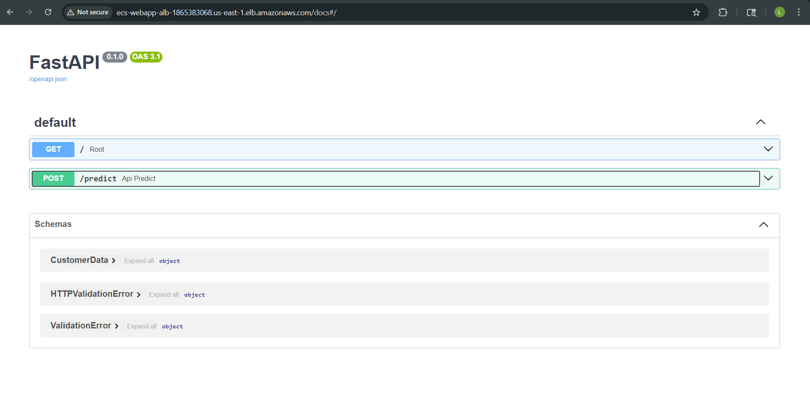

# Customer Churn Prediction End-to-End ML Project


This project demonstrates a complete End-to-End Machine Learning pipeline for predicting customer churn. It integrates various modern MLOps tools and practices, from data analysis to model deployment and CI/CD.

## 🚀 Key Features

*   **Data Analysis & EDA**: Comprehensive Exploratory Data Analysis using Jupyter Notebooks.
*   **Experiment Tracking**: Utilizes **MLflow** to track experiments, parameters, and metrics.
*   **Hyperparameter Tuning**: Implements **Optuna** for efficient hyperparameter optimization.
*   **Data Validation**: Uses **Great Expectations** to ensure data quality and integrity.
*   **Model Serving**: Deploys the best model as a REST API using **FastAPI**.
*   **Containerization**: Fully containerized application using **Docker**.
*   **CI/CD**: Automated pipeline using **GitHub Actions** to build and push Docker images to Docker Hub.

## � Screenshots

### User Interface



### API Documentation


## �📂 Project Structure

```
├── .github/workflows   # CI/CD pipelines (GitHub Actions)
├── .ml_clf_end_to_end  # Virtual environment (optional)
├── artifacts           # Stored artifacts (models, preprocessors)
├── notebooks           # Jupyter notebooks for EDA and experimentation
├── scripts             # Utility scripts
├── src                 # Source code for the application
│   ├── app             # FastAPI application
│   ├── data            # Data ingestion and processing
│   ├── features        # Feature engineering
│   ├── models          # Model training and evaluation
│   └── utils           # Utility functions
├── tests               # Unit and integration tests
├── dockerfile          # Docker configuration
├── requirements.txt    # Project dependencies
└── Setup.text          # Quick setup guide
```

## 🛠️ Installation & Setup

### Prerequisites

*   Python 3.11
*   Git

### 1. Clone the Repository

```bash
git clone <repository-url>
cd customer_churn_ml_end_to_end
```

### 2. Create Virtual Environment

It is recommended to use a virtual environment to manage dependencies.

```bash
# Create virtual environment
python3.11 -m venv .ml_clf_end_to_end

# Activate virtual environment
# Windows:
.\.ml_clf_end_to_end\Scripts\Activate
# Linux/Mac:
source .ml_clf_end_to_end/bin/activate
```

### 3. Install Dependencies

Upgrade pip and install the required packages using `uv` (or standard pip).

```bash
python.exe -m pip install --upgrade pip
# Using uv (recommended for speed)
pip install uv
uv pip install -r requirements.txt
# Or using standard pip
pip install -r requirements.txt
```

## 🏃 Usage

### Running the API locally

To start the FastAPI server locally:

```bash
python -m uvicorn src.app.app:app --host 0.0.0.0 --port 8000
```

Access the API documentation at: `http://localhost:8000/docs`

### Running Notebooks

To explore the data and training process:

```bash
jupyter notebook
```

Navigate to the `notebooks/` directory and open `EDA.ipynb`.

## 🐳 Docker

### Build the Docker Image

```bash
docker build -t customer-churn-app .
```

### Run the Docker Container

```bash
docker run -p 8000:8000 customer-churn-app
```

The API will be accessible at `http://localhost:8000`.

## 🔄 CI/CD Pipeline

The project includes a GitHub Actions workflow (`.github/workflows/ci.yml`) that automatically:
1.  Checks out the code.
2.  Logs in to Docker Hub.
3.  Builds the Docker image.
4.  Pushes the image to Docker Hub with the tag `lohitsasanapuri/telco-fastapi:latest`.

**Note**: This pipeline runs on push to the `main` branch. You need to configure `DOCKERHUB_USERNAME` and `DOCKERHUB_TOKEN` in your GitHub repository secrets.

## 🤝 Credits

This project was built following the End-to-End ML Project tutorial by **Anas Raid**. It has been customized and extended with additional features and personal implementations.
